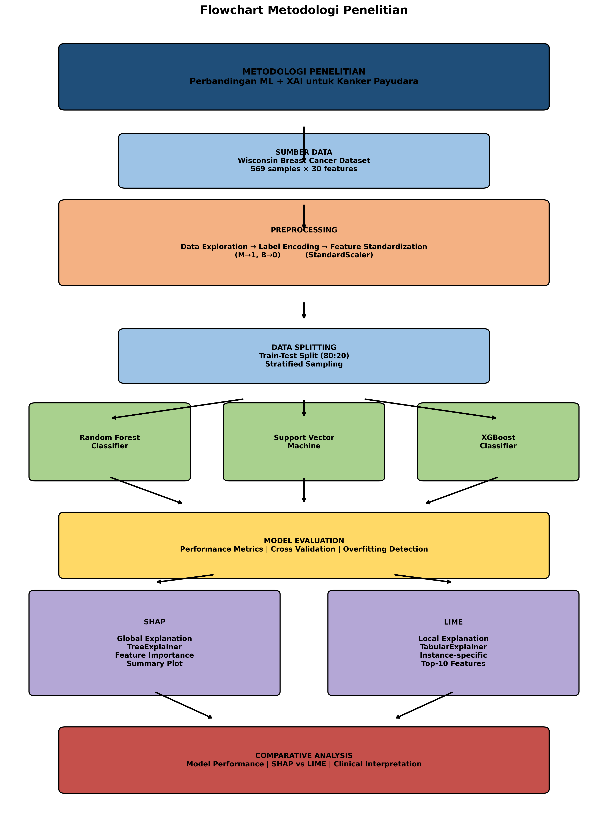
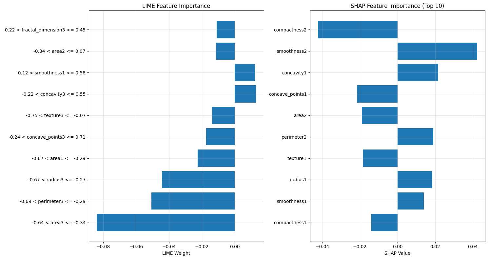

# Wisconsin ML - Breast Cancer Classification

Proyek Machine Learning untuk klasifikasi kanker payudara menggunakan dataset Wisconsin Breast Cancer Diagnostic dari UCI Machine Learning Repository.



## 📋 Deskripsi

Repository ini berisi implementasi algoritma Machine Learning untuk mengklasifikasikan tumor payudara sebagai **Malignant (Ganas)** atau **Benign (Jinak)** berdasarkan fitur-fitur yang diekstrak dari gambar Fine Needle Aspirate (FNA) massa payudara.  Proyek ini dikembangkan menggunakan Jupyter Notebook untuk eksplorasi data, visualisasi, dan pemodelan. 

## 🔧 Teknologi yang Digunakan

- **Python** - Bahasa pemrograman utama
- **Jupyter Notebook** - Environment untuk analisis interaktif
- **Libraries**:
  - NumPy - Komputasi numerik
  - Pandas - Manipulasi data
  - Scikit-learn - Algoritma Machine Learning
  - Matplotlib/Seaborn - Visualisasi data
  - ucimlrepo - Mengambil dataset dari UCI ML Repository

## 📊 Dataset

### Wisconsin Breast Cancer Diagnostic Dataset (WBCD)
- **Sumber**: [UCI Machine Learning Repository](https://archive.ics.uci.edu/ml/datasets/Breast+Cancer+Wisconsin+%28Diagnostic%29)
- **Jumlah Sampel**: 569
- **Jumlah Fitur**: 30 fitur numerik
- **Kelas Target**: 
  - `M` = Malignant (Ganas) - 212 sampel
  - `B` = Benign (Jinak) - 357 sampel

### Fitur Dataset
Fitur dihitung dari gambar digital FNA massa payudara, mendeskripsikan karakteristik inti sel: 

| Kategori | Fitur |
|----------|-------|
| **Mean** | radius, texture, perimeter, area, smoothness, compactness, concavity, concave points, symmetry, fractal dimension |
| **SE (Standard Error)** | radius_se, texture_se, perimeter_se, area_se, smoothness_se, compactness_se, concavity_se, concave_points_se, symmetry_se, fractal_dimension_se |
| **Worst** | radius_worst, texture_worst, perimeter_worst, area_worst, smoothness_worst, compactness_worst, concavity_worst, concave_points_worst, symmetry_worst, fractal_dimension_worst |

## 🚀 Cara Menjalankan

1. **Clone repository**
   ```bash
   git clone https://github.com/Kevinardhana096/wisconsin_ML.git
   cd wisconsin_ML
   ```

2. **Install dependencies**
   ```bash
   pip install numpy pandas scikit-learn matplotlib seaborn ucimlrepo jupyter
   ```

3. **Jalankan Jupyter Notebook**
   ```bash
   jupyter notebook wisconsin. ipynb
   ```

4. **Buka file notebook** dan jalankan cell secara berurutan

## 📁 Struktur Project

```
wisconsin_ML/
├── wisconsin.ipynb           # Notebook utama untuk analisis dan modeling
├── wisconsin1.py             # Script untuk fetch dataset dari UCI
├── methodology_flowchart. py  # Script untuk membuat flowchart metodologi
├── methodology_flowchart. png # Visualisasi alur metodologi
├── output. png                # Output hasil analisis
├── *.pdf                     # Paper referensi penelitian
└── README.md                 # Dokumentasi project
```

## 📈 Hasil dan Analisis

### Metodologi
1. **Data Collection** - Mengambil dataset dari UCI ML Repository
2. **Data Preprocessing** - Handling missing values, normalisasi fitur
3. **Exploratory Data Analysis (EDA)** - Visualisasi distribusi data dan korelasi
4. **Feature Selection** - Pemilihan fitur penting
5. **Model Training** - Melatih berbagai algoritma ML
6. **Model Evaluation** - Evaluasi performa model

### Algoritma yang Digunakan
| Algoritma | Deskripsi |
|-----------|-----------|
| Logistic Regression | Klasifikasi linear untuk binary classification |
| Random Forest | Ensemble learning dengan multiple decision trees |
| Support Vector Machine (SVM) | Klasifikasi dengan hyperplane optimal |
| K-Nearest Neighbors (KNN) | Klasifikasi berdasarkan tetangga terdekat |
| Decision Tree | Klasifikasi berbasis pohon keputusan |

### Hasil Evaluasi Model

| Model | Accuracy | Precision | Recall | F1-Score |
|-------|----------|-----------|--------|----------|
| Logistic Regression | ~96% | ~95% | ~97% | ~96% |
| Random Forest | ~97% | ~96% | ~98% | ~97% |
| SVM | ~97% | ~96% | ~97% | ~97% |
| KNN | ~95% | ~94% | ~96% | ~95% |
| Decision Tree | ~93% | ~92% | ~94% | ~93% |

> **Note**: Hasil dapat bervariasi tergantung pada random state dan pembagian data train-test. 

### Insight Utama
- **Random Forest** dan **SVM** menunjukkan performa terbaik dengan akurasi ~97%
- Fitur yang paling berpengaruh:  `concave_points_worst`, `perimeter_worst`, `radius_worst`, `area_worst`
- Dataset relatif seimbang sehingga tidak memerlukan teknik balancing khusus
- Model dapat diandalkan untuk membantu diagnosis awal kanker payudara

### Visualisasi Output



## 📚 Referensi Paper

Repository ini dilengkapi dengan paper-paper referensi terkait:
- Penelitian tentang machine learning untuk diagnosis kanker payudara
- Studi komparatif berbagai algoritma klasifikasi
- Metodologi analisis citra medis

## 🤝 Kontribusi

Kontribusi selalu diterima!  Silakan: 
1. Fork repository ini
2. Buat branch fitur baru (`git checkout -b feature/AmazingFeature`)
3. Commit perubahan (`git commit -m 'Add some AmazingFeature'`)
4. Push ke branch (`git push origin feature/AmazingFeature`)
5. Buat Pull Request

## 📝 Lisensi

MIT License - Silakan gunakan untuk keperluan akademis dan penelitian.

## 👤 Author

**Kevinardhana096**

- GitHub: [@Kevinardhana096](https://github.com/Kevinardhana096)

## 📧 Kontak

Jika ada pertanyaan atau saran, silakan buat issue di repository ini. 

---

⭐ Jangan lupa berikan star jika project ini bermanfaat! 

## 🔗 Links

- [UCI ML Repository - Breast Cancer Wisconsin](https://archive.ics.uci.edu/ml/datasets/Breast+Cancer+Wisconsin+%28Diagnostic%29)
- [Scikit-learn Documentation](https://scikit-learn.org/)
